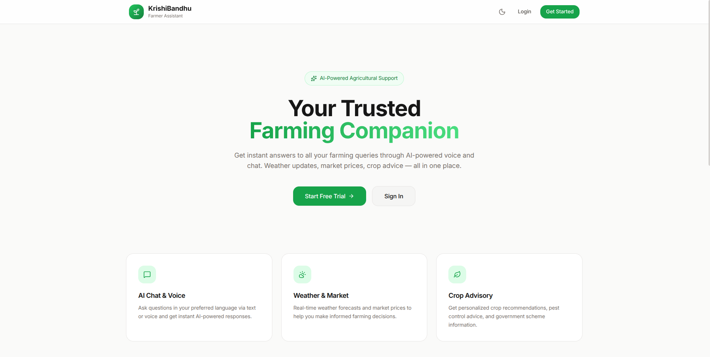
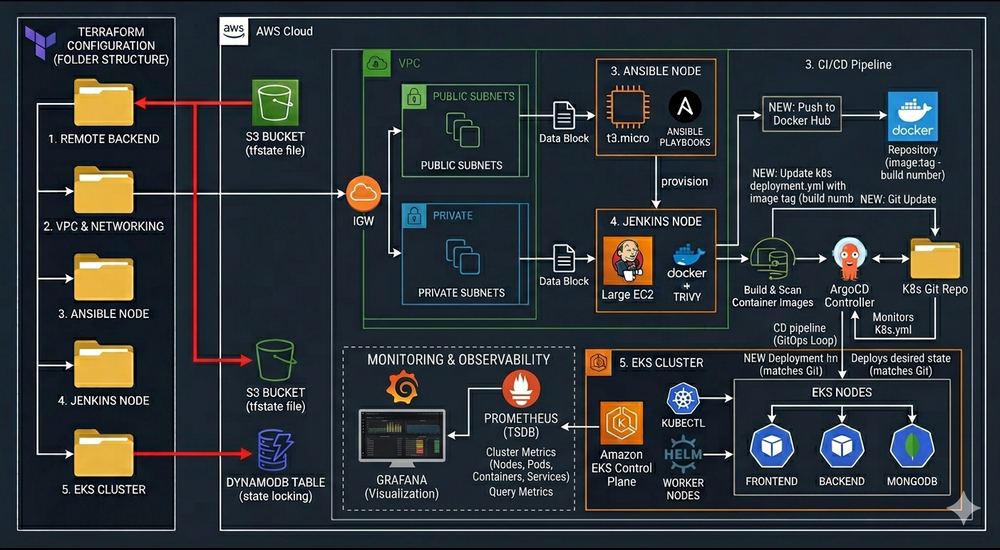

# 🚜 KrishiBandhu: Full-Stack Deployment Guide
**KrishiBandhu** is a MERN-stack AI Voice Assistant designed to help farmers resolve agricultural queries in real time.


**App GitHub Repo:** https://github.com/Adarsh097/KrishiBandhu.git


## Deployment
This repository is responsible for deploying and managing that application using a GitOps workflow.

This document serves as the **end-to-end deployment manual**, covering:

* Infrastructure provisioning (Terraform)
* Configuration management (Ansible)
* CI/CD pipeline (Jenkins)
* GitOps delivery (ArgoCD)
* Monitoring and observability

---

## 🔄 1. High-Level Architecture Flow


The system follows a **GitOps-driven architecture**, where infrastructure, application, and deployments are fully automated.

```text
Terraform → AWS Infrastructure → Jenkins CI → Docker Hub → Git (Manifests) → ArgoCD → EKS → Monitoring
```

**Flow Summary:**

* Terraform provisions infrastructure
* Jenkins builds and pushes images
* Git acts as the source of truth
* ArgoCD syncs deployments to Kubernetes
* Monitoring tools track system health

---

## 🏗 2. Infrastructure Layer (Terraform & Ansible)

The infrastructure is designed using a **modular Terraform architecture**, ensuring separation of concerns and easier scalability.

---

### 📦 Phase A: Foundation Layer

**Remote Backend**

* S3 bucket stores Terraform state (`terraform.tfstate`)
* DynamoDB ensures **state locking** to avoid conflicts

**Networking (VPC)**

* Custom VPC with:

  * Public subnets (external access)
  * Private subnets (secure workloads)
* Terraform `data` blocks used for dynamic referencing (`vpc_id`, `subnet_ids`)

---

### ⚙️ Phase B: Management Layer

**Ansible Node (t3.micro)**

* Central configuration controller
* Executes playbooks across infrastructure

**Jenkins Node (Large EC2 Instance)**
Provisioned via Ansible with:

* Jenkins (CI engine)
* Docker (containerization)
* Trivy (security scanning)

**Responsibilities:**

* Build automation
* Image security validation
* GitOps manifest updates

---

### ☸️ Phase C: Execution Layer

**Amazon EKS**

* Managed Kubernetes cluster
* Runs the MERN application

**GitOps Controller (ArgoCD)**

* Continuously monitors Git repository
* Syncs cluster state with Git

**Monitoring Stack (Helm आधारित setup)**

* Prometheus → Metrics collection
* Grafana → Visualization dashboards

---

## 🚀 3. CI/CD and GitOps Pipeline

The project follows a **GitOps model**, where **Git is the single source of truth** for deployments.

---

### 🔧 Step 1: Continuous Integration (Jenkins)

1. Developer pushes code to repository
2. Jenkins triggers pipeline
3. Docker image is built
4. Trivy scans image for vulnerabilities
5. If scan passes:

   * Image is pushed to Docker Hub
   * Tagged using:

     ```
     <image>:${BUILD_NUMBER}
     ```
6. Jenkins updates Kubernetes manifests in Git

---

### 🔁 Step 2: Continuous Delivery (ArgoCD)

1. ArgoCD monitors Kubernetes manifest repository
2. Detects updated image tag
3. Triggers deployment sync
4. Performs **rolling update** in EKS
5. Ensures cluster matches Git (desired state)

---

## 📊 4. Monitoring and Observability

A complete observability stack is implemented to ensure reliability and performance.

| Tool       | Scope              | Key Metrics                       |
| ---------- | ------------------ | --------------------------------- |
| Prometheus | Kubernetes Cluster | CPU, Memory, Pod health, Restarts |
| Grafana    | Dashboards         | System visualization, trends      |
| CloudWatch | AWS Resources      | EC2 health, networking, logs      |

**Coverage includes:**

* Node-level metrics
* Pod and container health
* Application performance
* Infrastructure monitoring

---

## 📋 5. Deployment Responsibility Matrix

| Stage          | Tool       | Responsibility                          |
| -------------- | ---------- | --------------------------------------- |
| Infrastructure | Terraform  | Provision AWS resources (VPC, EC2, EKS) |
| Configuration  | Ansible    | Setup Jenkins, Docker, Trivy            |
| CI Pipeline    | Jenkins    | Build, scan, and tag Docker images      |
| Image Storage  | Docker Hub | Store versioned container images        |
| CD Pipeline    | ArgoCD     | Sync Git with Kubernetes cluster        |
| Runtime        | AWS EKS    | Run MERN + Voice AI services            |

---

## 🎯 6. Outputs


 --- 
## 🔐 7. Security and Best Practices

* Remote Terraform state stored securely in S3
* State locking enforced via DynamoDB
* Docker images scanned using Trivy
* No hardcoded secrets (use Kubernetes Secrets / Sealed Secrets)
* Immutable deployments using versioned image tags

---


## ⚠️ Important Note

DynamoDB in this project is used **only for Terraform state locking** and is **not connected to the application database**.

The application database (MongoDB) runs inside the Kubernetes cluster.

---

## 📌 8. Key Takeaways

This project demonstrates a **production-grade DevOps system** with:

* Modular Infrastructure as Code
* Automated CI/CD pipeline
* GitOps-based deployments
* Secure and scalable cloud architecture
* Full observability stack

---
---
---